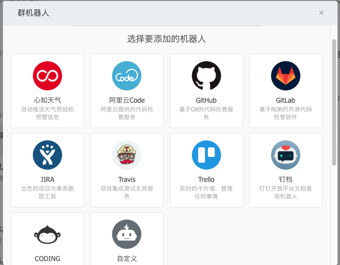
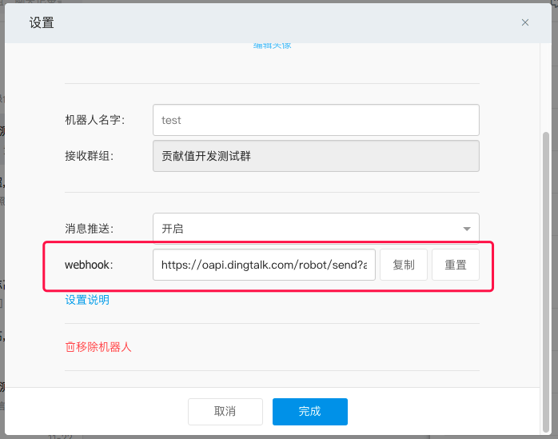
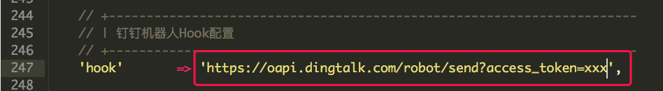
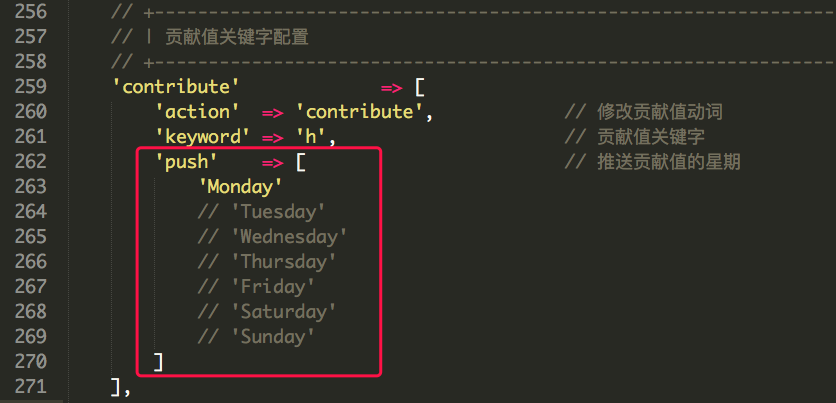

# 梦云智课表管理系统

## 贡献值管理功能
https://github.com/yunzhiclub/courseManageSystem

### 如何使用

打开`Github`仓库，依次选择`Settings`->`Webhooks`->`Add webhook`，添加一个`web`钩子。

依次填入我们接收数据的`url`，类型选择`application/json`，事件选择`Let me select individual events`。

事件中选择`Pull Request`，点击`Add webhook`添加完成。

使用`Github`提交一个`Pull Request`。

标题中写本次提交的所花费的时间，例： `xxx 几h`。

注意：标题中只允许出现一个空格，即`完成XXX功能 2h`，出现额外空格会出现错误。

如果受人帮助，想给他人分享贡献值，在主体中除了`resolve`某个`issue`之外，还要写上与他人共享，`share&用户名 几h`。

可以直接在贡献值管理模块查看贡献值。

同时查看贡献值的详细信息。

同时也可以对贡献值进行增加或删除，如用贡献值换置设备。

### 注意

**因为本系统与`Github`对接，所以需要确保您在本系统中的用户名与`Github`用户名保持一致才可进行贡献值统计。**

## 生产环境部署方法
1. 启动docker `cd docker && docker-compose up -d`
2. 更改配置文件`app/databash.php`数据库信息：mysql56 root 3306
3. 连接数据库，并导入`duty.sql`
4. 停止docker `docker-compose stop`
5. 注释掉mysql的ports端口暴露。
6. 重新启动docker `docker-compose up -d`

## 钉钉自动推送配置方法

### 钉钉自动推送简介

钉钉推送系统源代码在`app/application/index/controller/DingController.php`文件中，触发其中的`push`方法即可实现课表消息与贡献值信息的自动推送。

课表信息的推送可以自定义推送时间，从早`7`点到晚`21`点，只要触发该方法就会有消息推送到钉钉。

|    触发时间    | 课程节数信息 |
| ------------- | --------- |
| 7:00  - 9:00  |   1 - 5   |
| 9:00  - 12:00 |   2 - 5   |
| 12:00 - 15:00 |   3 - 5   |
| 15:00 - 17:00 |   4 - 5   |
| 17:00 - 21:00 |     5     |

### 相关配置

#### 钉钉机器人`Hook`配置

在钉钉群中，我们可以添加群机器人，钉钉为我们内置了多种的机器人，我们可以选择任一的机器人，但为了不同的机器人推送不同格式的小时，我们建议自定义一个机器人：

每个机器人都有一个`WebHooks`用于区分不同的机器人地址，我们需要将我们机器人`WebHooks`地址复制下来，配置到我们的项目中。

打开`app/application/config.php`，该文件用于配置，在第`247`行左右，是我们机器人的`hook`配置，将机器人的`hook`地址拷贝到下图标示的字符串中。

***注意：这里的配置项是一个单引号的字符串，不要配置错了。***

#### 贡献值推送日期配置

贡献值推送可以配置推送的日期，如我可以配置为星期一推送，也可以配置为一周几天都推送。

在`app/application/config.php`的第`262`行左右，是一个用于配置周几进行推送的数组，想哪天推送，放到数组中即可。

### 定时脚本

1. 新建一个`shell`脚本，`touch ding.sh`。
2. 在脚本中编写命令：`/usr/local/bin/curl http://coursemanagesystem.yunzhiclub.com/index/ding/push`，用`curl`触发`DingController`中的`push`方法，当然，如果服务器配置的路径不同，那配置的路由也会有所出入，本脚本就是编写一个访问`push`的命令文件，新建一个`shell`文件是考虑到拓展，可能会执行好多个定时任务，时间一致，直接写在该脚本中就一并执行了。

定时任务配置请参考团队博客：[Crontab 设置定时任务](http://www.mengyunzhi.com/index.php/2017/11/29/freebsd-use-crontab-set-task/)

整个配置不是很难，细心一点，成功触手可及。