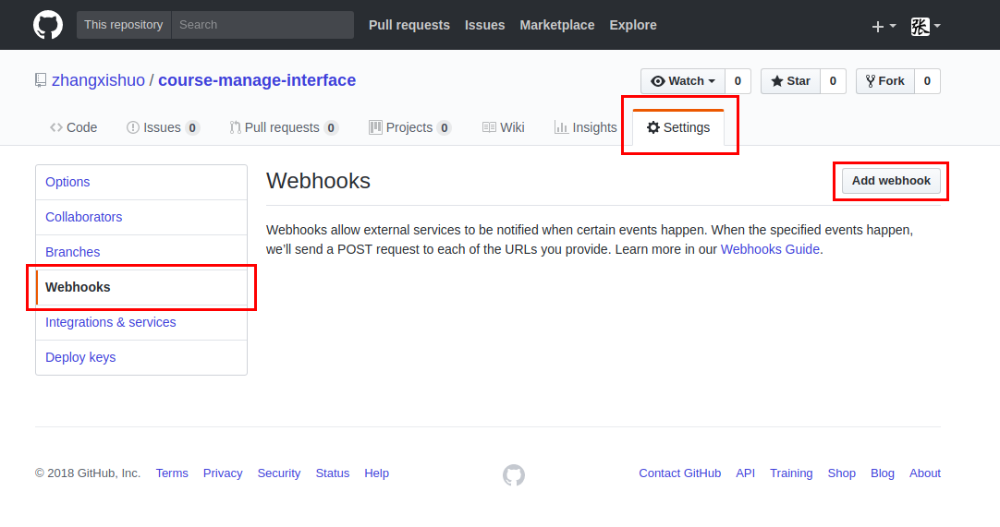
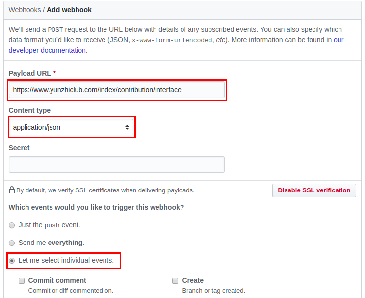
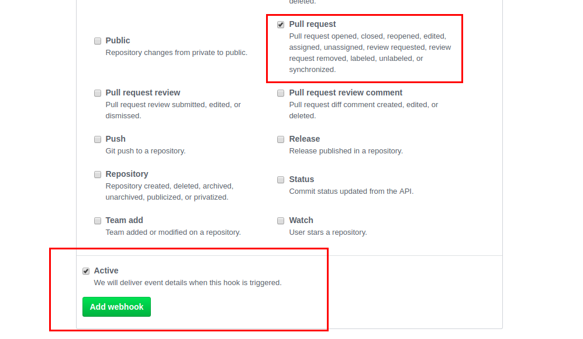
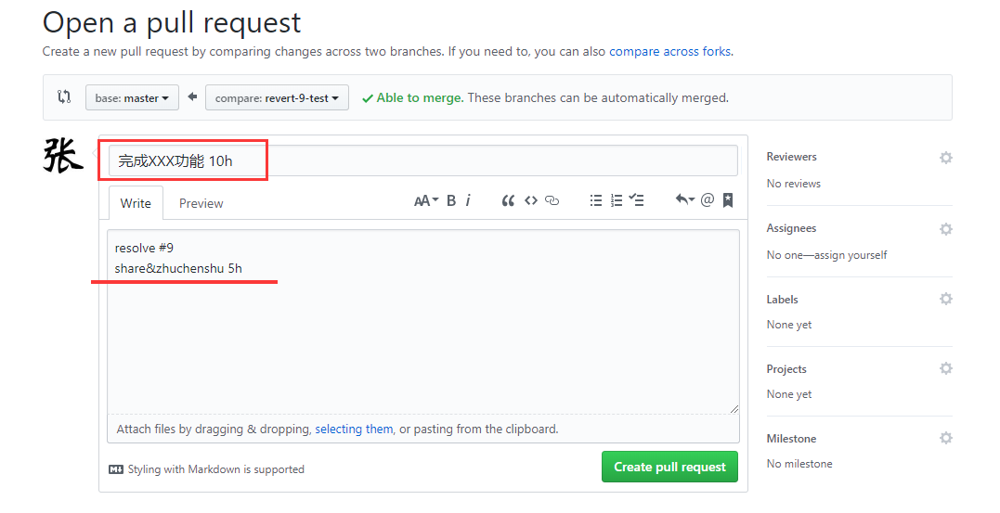
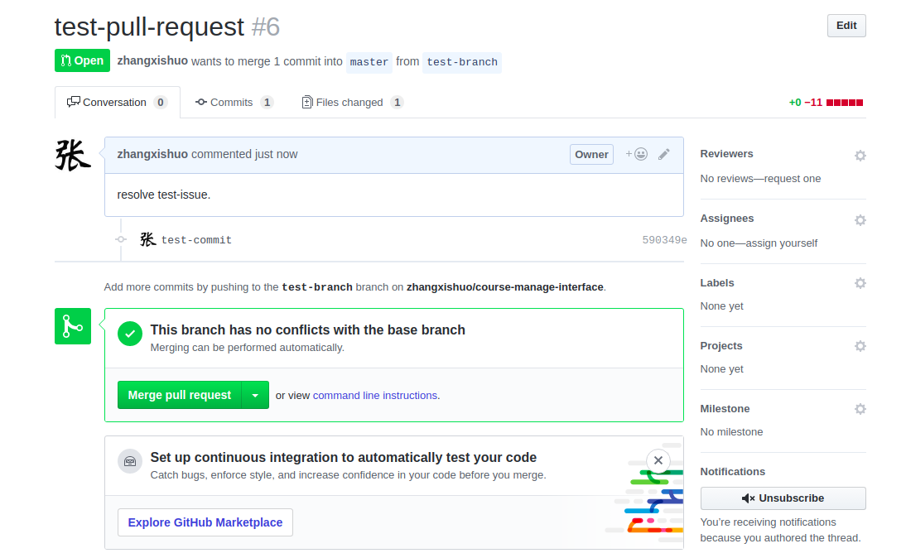
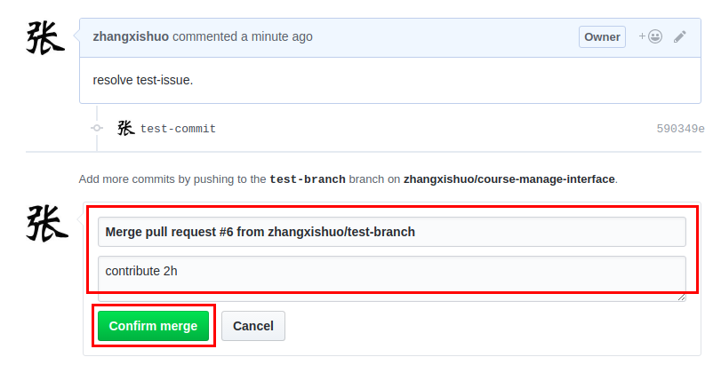
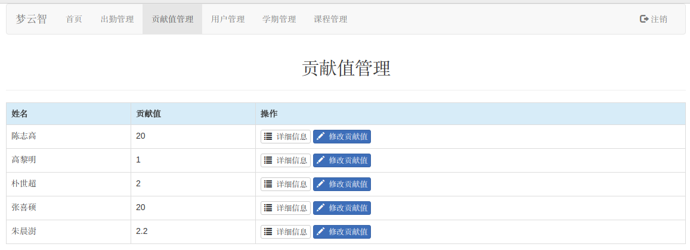
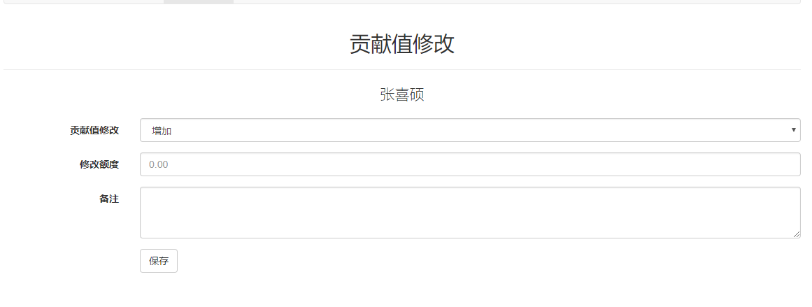

# 梦云智课表管理系统

## 贡献值管理功能

### 数据库配置

在原数据库上略做修改。

`User`表中添加字段`contribution`，数据类型为`float`，默认值为`0`。

新建数据表`yunzhi_contribution`。

字段 | 数据类型 | 属性 | 注释
- | :-: | :-: | -:
id | int | 主键、非空、自增 | 主键id
username | varchar(255) | 非空、外键 | 对应user表中的username
state | float | 非空 | 用户贡献值状态
time | int | 非空 | 时间戳

### 如何使用

打开`Github`仓库，依次选择`Settings`->`Webhooks`->`Add webhook`，添加一个`web`钩子。

依次填入我们接收数据的`url`(`C`层中的`interface`方法)，类型选择`application/json`，事件选择`Let me select individual events`。

事件中选择`Pull Request`，点击`Add webhook`添加完成。

使用`Github`提交一个`Pull Request`。

点击`Merge pull request`。

在弹出来的`Confirm merge`对话框中输入`contribute 2h`，这里的`contribute`和`h`是可以在`config.php`中自定义的配置项，`Confirm merge`。

这时，`Github`会向我们的接口中发送消息，同时统计贡献值。我们可以查看详细信息以及对贡献值进行修改。

### 注意

**因为本系统与`Github`对接，所以需要确保您在本系统中的用户名与`Github`用户名保持一致才可进行贡献值统计。**
